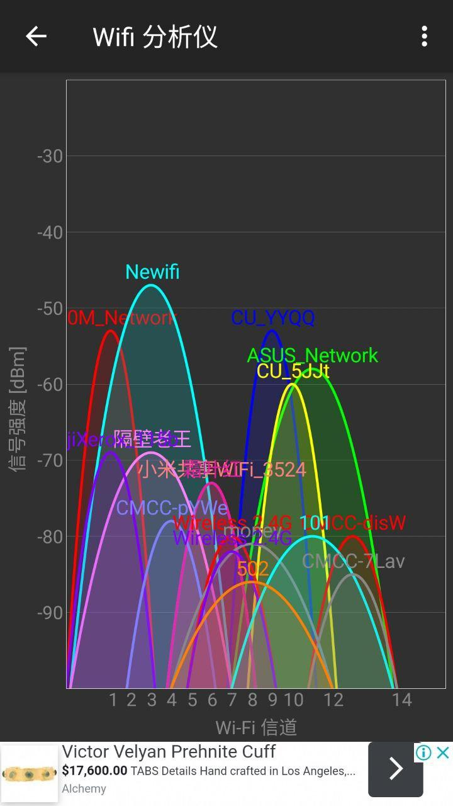

# Newifi-D1-新路由2-EEPROM
从某宝入了个Newifi-D1 ，发现2.4G信号非常弱，隔一堵墙后，一连接，信号立马消失。
原因应该是原来的路由用的eeprom有问题，从网上找了好几个版本的EEPROM，比较2.4G信号强度和稳定性

## EEPROM 比较
1. eeprom.bin 下载从CSDN 
https://download.csdn.net/detail/a11717959/10628490
https://download.csdn.net/download/cheng3900/11250957

newifi_d1的eeprom备份。用作恢复eeprom分区数据。
个人用的是最好的eeprom，2.4G/5G信号都非常强，远距离隔墙均无连接问题，但是，网络连接好像不是很顺畅，
有点断流的意思。

2. csdn_epprom_custom.bin
将1.的原ROM按网上教程作出修改主要在000000A0, 000000C0

使用mtd或者breed 将自己的eeprom备份出来，分别修改以下两行
```
000000a0 为 C9 C8 C8 C8 C6 C2 C0 C9 C8 C8 C6 C4 C2 C0 00 00
000000c0 为 0E 01 0D 14 14 01 00 00 00 00 00 00 00 00 00 00
```
保存后使用mtd或者breed单独刷入eeprom文件，即可增强信号
原文链接：https://blog.csdn.net/sxhexin/java/article/details/88379433

测试结果信号相比1.稍弱一点，但是稳定性非常好。

3. eeprom.mao.bin
参考: [强如老狗]新路由3newifi3(newifi d2)修改eeprom解决2.4G信号问题修改MAC方法
https://aisoa.cn/post-2566.html
实际测试，信号和稳定性不如1.和2.

4. 新3杂交eeprom终结版.bin
这个版本都是一致好评是和极路由B70的EEPROM杂交，实际使用2.4G信号不错，但仍不如1. 
5G信号远弱于1.和2.的ROM，但是2.4G的信号稳定性不错。

## EEPROM - 按MT7612文档校准5G与新3杂交2.4G
csdn_epprom_custom_2_20230110.bin

0x50H = 0x86 (减少2.4GHZ在40M传输功率-3dBm)

0x45H/0x49H/0x4dH = 0x8C (外部LNA增益+12dB)

0x51H = 0xC8 (增加5GHZ在80M传输功率+4dBm)

0x52H = 0xC8 (增加5GHZ在80M传输功率+4dBm)

0x64H = 0x2e (目标54M传输功率23dBm = 23 * 2 = 46 = 0x2e)

0x69H = 0x2e (目标54M传输功率23dBm = 23 * 2 = 46 = 0x2e)

# 结论
csdn_epprom_custom.bin 是个人newifi d1 路由上跑得最稳定（连接无断流），2.4G/5G信号均比较强。
下图是隔了一堵墙后的wifi连接测试图：
        

## Youtube performance


